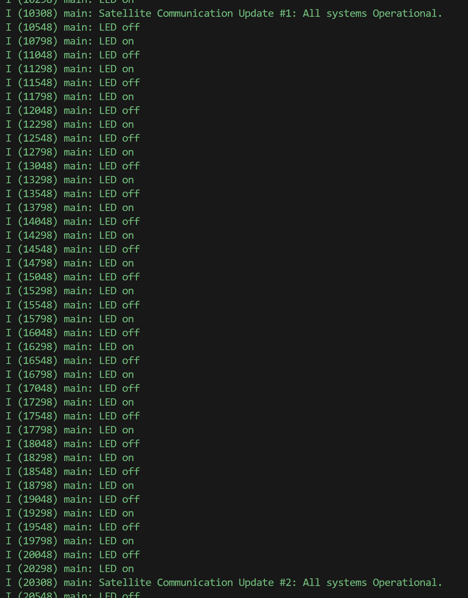
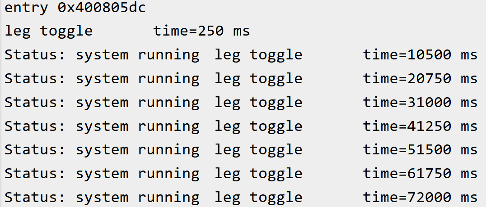

# Application 1

**Name:** Jonah Sprandel  
**UCFID:** 5439542

---

## Q1. Vary Priorities

**Question:** Change the print task’s priority to 2 (higher than blink’s 1). With such short tasks and delays, you may not notice a big difference, but in principle the print task would preempt the blink task if it were ready. Given both tasks spend most time sleeping, the effect is minimal. In later projects with CPU-bound tasks, priority will matter more. Does anything happen to the LED if you increase the delay within the print task? What if you increase the number of characters printed?  

**Answer:**  
No, increasing the delay within the print task from 10,000 to 20,000 has no effect to the LED blink functionality. Adding 90 characters to the print task (minimum 57 characters before depending on the counter variable) did not affect the LED functionality either.

---

## Q2. Increase Load

**Question:** Remove the vTaskDelay in the print task (making it a tight loop printing continuously). Be careful – this will flood the console. But it illustrates a point: if one task never yields, it can starve the other. In this case, the LED might stop blinking on schedule because the print task hogs the CPU. Describe the behavior you observed.  

**Answer:**  
When I first tried this, I observed no noticeable change in hardware behavior. The LED continued toggling every 250 ms as expected. The main difference was that the print task executed much more frequently. This was because I was using the ESP_LOGI macro rather than printf, which ESP-IDF recommends for logging. When I switched to using a printf task running in a tight loop, the LED blinking stopped completely because the print task hogged the CPU, which shows the importance of task yielding.  

In the ESP-IDF logging system, UART transmission is managed by a dedicated logging task that operates asynchronously and is thread-safe. If this logging task ever falls behind, such as when the memory buffer it uses fills faster than it can be drained, there could be slight delays in logs appearing on UART. Conversely, if the logging task were given very high priority, it could interfere with other tasks, such as the LED blinking. The key point is that the system is carefully balanced: the logging task handles UART output independently of your main application tasks, yielding periodically to allow other tasks to run. This asynchronous design ensures that logging doesn’t block or “starve” other tasks, while still keeping log output timely and responsive.

---

## Q3. Thematic Customization

**Question:** Assume you were a developer of one of these applications - might there be some considerations that you would want to take into consideration in how verbose (or not) you want your messages to be? Additionally, explain why this system benefits from having correct functionality at predictable times.  

**Answer:**  
In my satellite telemetry application, I log messages like “Satellite Communication Update #X: All systems Operational” every 10 seconds. Verbosity must be balanced to provide meaningful updates without overwhelming the logging system. Some considerations for my scenario could be the communication bandwidth, resource usage, and predictable timing. Correct functionality at predictable intervals is critical because it ensures reliable telemetry and consistent monitoring. The ESP-IDF logging task allows messages to be sent without blocking other tasks, so periodic updates and other operations continue on schedule.

---

## Q4. Identify/Verify Task Period

**Question:** Identify/verify the period of each task; you can try to do this via the simulator, or perhaps by printing data to the console, or connect the outputs to the logic analyzer.  

**Answer:**  
I measured the periods by calculating the difference between each ESP_LOG message, as shown below.  
- LED blink task period: 250 ms (250 ms per LED state)  
- Print task period: 10 s  

*Example measurement:*  

---

## Q5. Did our system tasks meet the timing requirements?

**Answer:**  
Yes, my system tasks met their timing requirements.  

- How do you know?  
I confirmed this by observing the timestamps in the ESP_LOG output. The LED blink task consistently toggled every 250 ms, and the print task executed every 10 seconds, matching the intended periods set by vTaskDelay.  

- How did you verify it?  
I verified the timing by reviewing the log messages generated during execution. The intervals between consecutive log entries for each task matched the expected periods. Additionally, the LED’s physical behavior and the consistently printed messages provided further confirmation that both tasks were running on schedule.

---

## Q6. Single-Loop Behavior

**Question:** If the LED task had been written in a single-loop with the print (see baseline super-loop code), you might have seen the LED timing disturbed by printing (especially if printing took variable time). Did you try running the code? Can you cause the LED to miss it's timing requirements? If yes, how? If no, what did you try?

**Answer:**  
Did you try running the code?  
Yes, I tried running the super-loop code as provided.  

Can you cause the LED to miss it's timing requirements?  
Yes, the LED timing requirement is already missed in the provided baseline super-loop code because the LED toggle code has to wait 10,000 ms after the print function is called. In total, the LED is toggled every 10,250 ms.  

If yes, how?  
The LED timing requirement is already missed in the provided super-loop code because it is a single loop that requires each "task" to finish before the next one can occur. In this case, the print function was written to take extra long to show that the LED toggle had to wait for the printing to finish.  

If no, what did you try?  
N/A  

*Example measurement:*  

---

## Q7. Multitasking and Timing Determinism

**Question:** Do you agree or disagree: By using multitasking, we were able to achieve timing determinism for the LED blink. Why or why not?

**Answer:**  
Yes, I agree that using multitasking allowed us to achieve timing determinism for the LED blink. vTaskDelay provides approximate timing, so small variations can occur, but separating the LED task from the print task ensures the LED is not blocked by long or variable-duration operations. For even more precise timing, vTaskDelayUntil or a hardware timer driven by the ESP32’s crystal oscillator could be used to ensure highly consistent blink intervals as the application code gets more complex.
